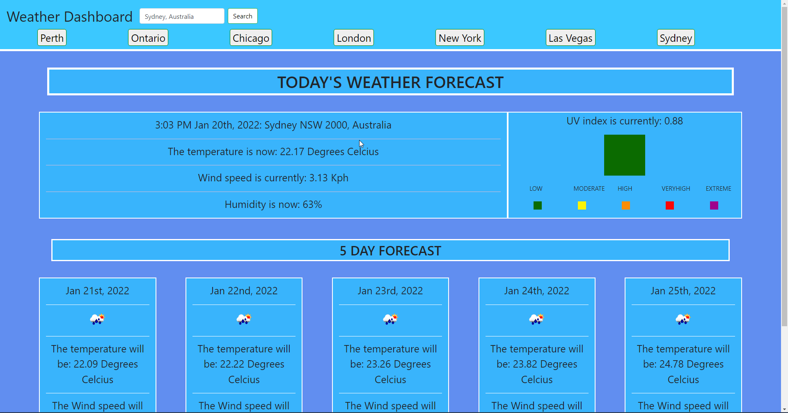

# Homework Week 6 Weather Dashboard Michael Ariti

## Weather Dashboard

The purpose of this repository is to create a weather dashboard that is updated based on the users search for a city.

## Features

1. Current forecast and 5 days forecast
2. Dynamic UV index that changes colour based on UV index
3. Automatically saves the last 7 searches as buttons that you can use to reload the search, buttons check so no duplicates are saved, also drops off the first button if an 8th search is made.
4. Searches are stored in localStorage

## File Directory

You will find the index.html next to this readme, which is the finished website code.

In the assets folder you will find 
1. The guidelines to this homework
2. The css style sheet for the index.html
3. The screenshot of the finished website which is pictured below.
4. The javascript used to run the dashboard.

## Secreenshot

## Webpage URL
[Weather-Dashboard-URL](https://michaelfellas.github.io/Weather-Dashboard/)

### End

Michael Ariti 2022